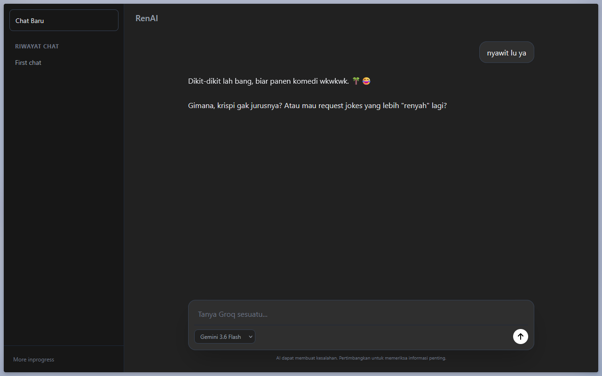

# RenAI - AI Aggregator
Sebuah website AI Chat Aggregator yang menyediakan model model AI populer siap pakai

Live Website : https://renai-three.vercel.app/



## Fitur

- Beragam Model AI Siap Pakai
- Cepat dan Ringan
- Tampilan Modern

## Tech Stack

### Frontend:
- HTML
- CSS
- Tailwind CSS
- JS

### Backend:
- Python
- Flask

## Instalation

```bash
git clone https://github.com/rendiataya/renai.git
cd renai
pip install -r requirements.txt
py main.py
```

Buat file `.env` pada folder lalu isi sebagai berikut
```env
GROQ_API_KEY = your_groq_key
GEMINI_API_KEY = your_gemini_key
```

## Project Structure

```text
renai/
├── templates
│   ├── index.html
├── main.py
├── models.json
├── pyproject.toml
├── requirements.txt
```

## Roadmap

- [x] Basic Interface
- [x] Model selection
- [] Mobile design
- [] Functional sidebar
- [] File upload
- [] Auth 

## Author

Made with ❤️ by Ren